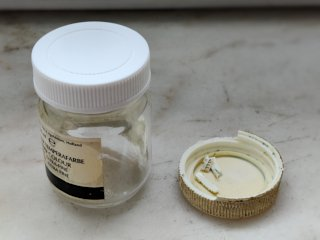

# Customizable Screw Cap
*3D printable cap or lid with screw thread for tubes and round boxes*

### License
[Creative Commons - Attribution](https://creativecommons.org/licenses/by/4.0/)

### Attribution
This uses the `screw_extrude` function from “customizable round box with threaded lid” by FaberUnserzeit a.k.a. Philipp Klostermann ([Thingiverse thing:1648580](https://www.thingiverse.com/thing:1648580)).

### Gallery

[🔎](images/cap1-off.jpg) [🔎](images/cap1-on.jpg) [🔎](images/cap2-off.jpg) [🔎](images/cap2-on.jpg) [🔎](images/cap3.jpg) [🔎](images/model.jpg)

## Description and Instructions

This is an OpenSCAD Customizer for generating screw caps for tubes (toothpaste, gel, …), or lids for round boxes. Some possible use cases:
* You lost the cap for the tube or box,
* The original cap broke or your dog chewed on it,
* The original cap is large and bulky, and you want something more elegant to carry in a travel bag.

To generate a cap or lid for your particular needs, first do some accurate measurements on the thing the cap will need to fit on. A calliper is pretty much essential for this, although you might also get somewhere with a simple ruler and some good eyeballing. The more accurate the values, the better the chance your first printed cap will be a perfect fit and you won't need trial-and-error.

Measure these dimensions:
1. The outer diameter of the screw thread.
2. The pitch of the screw thread. It is better to measure as many turns together as possible, and then divide the measured distance by this number of turns. I usually measure with both the inside and outside prongs of the calliper to verify that I'm not making any error in the measurement.
3. The length of the threaded end that must be covered by the cap. Some tubes have a thicker ring at the base of the thread, you should not include this in the measurement.

Once you have those measurements, open the `.scad` file in [OpenSCAD](https://www.openscad.org/) and **[use the OpenSCAD Customizer](https://www.dr-lex.be/3d-printing/customizer.html)** to enter the values and generate the final STL file. Next to the above parameters, there are many other things that can be customised. The most important parameter is the spacing: if the cap is too sloppy then increase this value, if it is too tight, then lower it. For me, a spacing of 0.40 mm works well.
For certain lids it may be necessary to increase the gap between threads. The gap is expressed as a fraction of the pitch and the higher the value, the more the thread shape will be squished. High gap values may be more difficult to print cleanly.

Other parameters define the overall shape of the cap or lid. You can opt to give the cap a ribbed (knurled) outside for better grip.

### Print Settings I've used

For finer screw threads, a layer height of 0.1 mm is recommended. For coarser threads, 0.15 mm may suffice, and for big lids 0.2 mm may even be OK. The caps shown in the photos were printed with 3 perimeters. I used ABS, but in general PETG is probably the best material choice because of its toughness and resilience against chemicals. Of course PLA will also work fine in many cases.

## Example files

The `examples` folder contains some pre-rendered models of the presets.

- `Flexium` is for a metal tube of anti-inflammatory gel, and might fit similar tubes.
- `medicalBottle` fits many of the typical bottles used in medicine. The `polished` model has been tweaked in Blender to look nicer. (Should probably be used with an extra seal or wad.)
- `OralB-75ml` fits a plastic toothpaste tube and might also fit similar tubes.
- `Talens-paint-50ml` fits a small glass jar of paint. This also has a `polished` model that looks more like the original.

## Updates

### 2020/07/02
First published.

### 2022/04/08
Added thread gap and increased limits on some parameters.

### 2023/01/05
Added option for extra unthreaded space on inside of cap, and allow bottom to be 0 to generate an open threaded tube.

### 2023/05/07
Added option for hole in the cap.

## Tags
`customizable`, `customizer`, `openscad`, `tube`, `box`, `lid`, `cap`, `thread`
